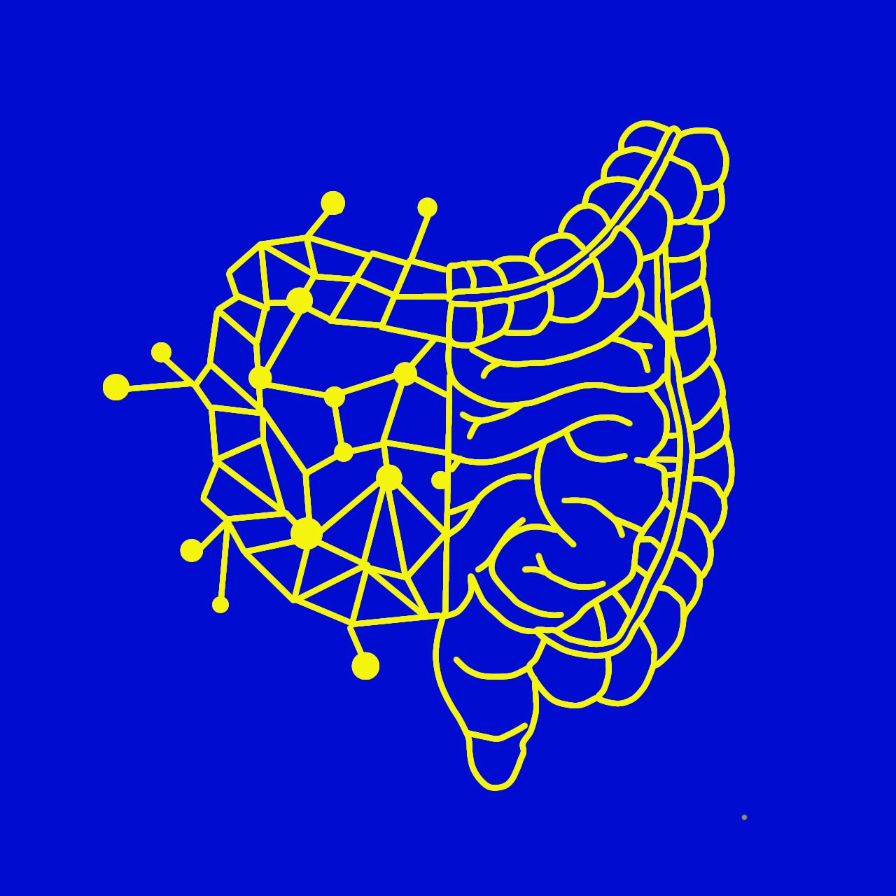

# GIC-quAI: Quantum AI for Colorectal Cancer Diagnosis



## Introduction

The rapid advancement of classical machine learning (ML) algorithms has significantly enhanced image processing capabilities. However, the energy consumption associated with high-performance computing (HPC) for these tasks is increasingly unsustainable. Classical methods, while effective, face scalability challenges due to the exponential increases in computational demands as data volumes grow.

Gastrointestinal (GI) cancers, particularly colorectal cancer (CRC), represent a significant global health challenge, with over 2 million new cases diagnosed annually. The **G-quAI** project leverages quantum computing to enhance artificial intelligence (AI) models for CRC diagnosis and prevention. By integrating **Quantum Neural Networks (QNNs)** and **Quantum Support Vector Machines (QSVMs)**, the project seeks to accelerate image analysis, improve diagnostic precision, and enhance energy efficiency.

### Key Objectives

- Develop scalable and energy-efficient AI solutions for CRC diagnosis.
- Utilize quantum computing to optimize image classification and feature extraction.
- Investigate the potential of **Quantum Evolutionary Kernels (QEKs)** in AI-driven medical imaging.
- Compare the efficiency of **Quadence-based QNNs** and **Pulser-based Graph ML** approaches.

## Mathematical Formulation & Solution Strategy

### Quadence Quantum Neural Networks

This approach focuses on encoding grayscale images into quantum states using **Flexible Representation of Quantum Images (FRQI)**. The **QNN model** is trained to classify synthetic image datasets generated with gradient backgrounds and geometric shapes. Key features include:

- **Quantum Encoding:** Images are transformed into quantum states for efficient processing.
- **Variational Quantum Circuit (VQC):** Utilized for training and inference.
- **Synthetic Dataset:** 4×4 grayscale images with gradient backgrounds and ellipses.

### Pulser Graph-Based ML

An alternative method leveraging **graph-based quantum state encoding** using **Pasqal's Pulser framework**. This technique represents images as graphs, where:

- Each node in the graph corresponds to a qubit.
- Quantum evolution kernels process image features.
- The dataset includes synthetic **256×256 colonoscopy-like images**, featuring **realistic polyp structures**.

## AI Contribution & Methodology

Two main quantum-enhanced AI techniques are explored:

1. **Quantum Neural Networks (QNNs):**
   - Leverages **Qadence** for FRQI-based image encoding.
   - Uses **quantum circuits** for feature extraction and classification.
2. **Quantum Evolutionary Kernels (QEKs):**
   - Explores **quantum-enhanced evolutionary algorithms**.
   - Utilizes **Pulser-based analog quantum computing** for optimization.

## Image Generation & Dataset

### Synthetic Dataset Generation

To optimize the quantum image processing pipeline, a controlled synthetic dataset is created:

- **Quadence-based QNNs**: 4×4 grayscale images with gradient backgrounds and ellipses.
- **Pulser-based Implementation**: 256×256 colonoscopy-like images with polyp segmentation.

The dataset is stored in **NumPy (.npy) format** and labeled with a CSV file (`labels.csv`).

## Quantum Encoding & Model Implementation

### Quadence-Based QNNs

- **FRQI Encoding**:
  - Encodes pixel intensity into quantum states.
  - Uses **rotation gates** for quantum amplitude representation.
- **Quantum Neural Network Architecture**:
  - **Feature Encoding Layer**: Maps classical image data to quantum states.
  - **Variational Layers**: Alternating **RY rotations and CNOT gates** for entanglement.
  - **Quantum Measurement**: Output obtained via parity measurements.
- **Training Strategy**:
  - Uses **mini-batch gradient descent**.
  - Optimizers: **Adam, AdamW, and SGD**.
  - Loss Function: **Binary Cross-Entropy with Logits (BCEWithLogitsLoss)**.

### Pulser Graph-Based ML

- **Graph-Based Encoding**:
  - Images are converted into **graph representations**.
  - **Quantum Evolution Kernels (QEKs)** process the structured data.
- **Quantum Machine Learning Workflow**:
  - Uses **Pasqal’s neutral atom processors**.
  - Incorporates **Hamiltonian evolutions** for feature extraction.
  - Optimizes **energy-based classification methods**.

## Results, Evaluation & Roadmap

### Performance Evaluation

- **Classification Metrics**: Accuracy, Precision, Recall, F1-score.
- **Confusion Matrix**: Visualizing misclassifications.
- **Energy Efficiency**: Evaluating potential energy savings vs. classical HPC.

# Quadence-based Implementation Performance:

- 4x4 Images:
- - Accuracy: 90.6%
- 8x8 Images:
- - Accuracy: 69.1%

# Pulser-based Implementation Performance:

- 256x256 Images:
- - Accuracy: 62.5%

### Future Work

- **Hybrid Quantum-Classical Models**: Explore more expressive feature maps.
- **Alternative Encoding Methods**: Investigate NEQR for more compact representation.
- **Optimization Strategies**: Explore gradient-free optimization.
- **Hardware Integration**: Testing models on real quantum processors.

## Repository Structure

```plaintext
📂 GIC-quAI
 ├── 📂 code               # Main codes
 ├── 📂 data               # Synthetic datasets
 ├── 📂 docs               # Documentation
 ├── 📂 results            # Results and benchmarks
 ├── 📂 test               # MWEs
 ├── .gitignore            # Ignored Files
 ├── requirements.txt      # Required packages 
 ├── README.md             # Project documentation
```

## How to Run

1. **Clone the repository**:

   ```sh
   git clone https://github.com/pasqal-io/Pasqal_Hackathon_Feb25_Team_02
   cd Pasqal_Hackathon_Feb25_Team_02
   ```
2. **Install dependencies**:

   ```sh
   pip install -r requirements.txt
   ```
3. **Run script**:

   For the Pulser-based implementation

   ```sh
   cd code/Pulser_implementation
   python3 pipeline/main.py
   ```

   or for the Qadence-based implementation

   ```sh
   cd code/Qadence_implementation
   python3 Qadence_QNN.py
   ```

---

The code developed in this repository use python 3.10

**GIC-quAI** aims to push the boundaries of AI-driven medical imaging by integrating quantum computing into cancer diagnostics. 🚀
